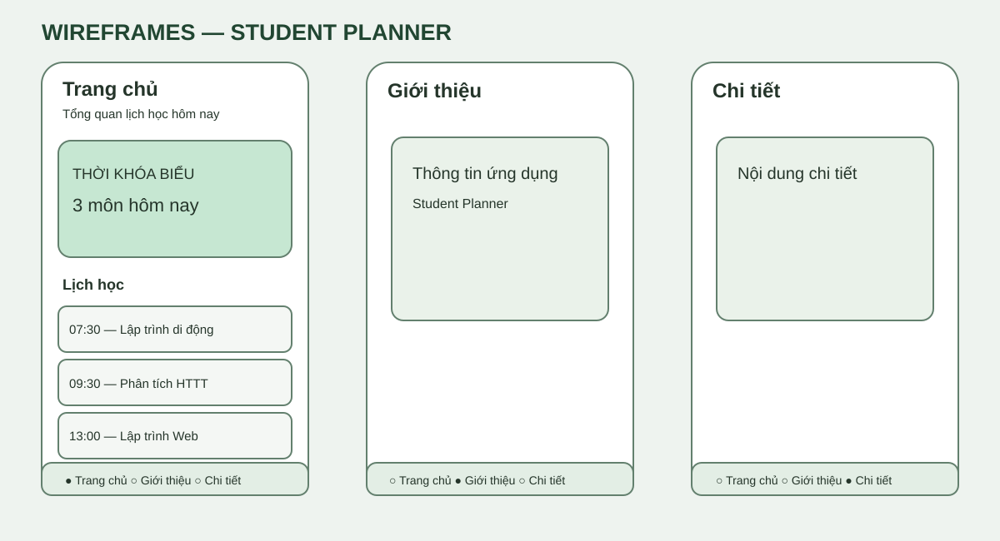

# Bài tập Flutter — Bottom Navigation Bar và Screen

**Project:** Student Planner (ứng dụng lịch học mẫu). Dựa trên nhánh `flutter-midterm-exam`, triển khai độc lập trên nhánh này, không ảnh hưởng các nhánh WebNC.

## 1. Link README và wireframes



Ảnh thiết kế: [docs/wireframes.svg](docs/wireframes.svg).

## 2. Code Bottom Navigation Bar

[lib/main.dart](lib/main.dart): `NavigationBar` có 3 mục Trang chủ / Giới thiệu / Chi tiết. Chạm vào mục sẽ chuyển trang bằng `setState` và `IndexedStack` giữ trạng thái các trang.

## 3. Ảnh chụp Bottom Navigation Bar

**Chưa có ảnh chụp thực tế.** Chạy app trên trình duyệt hoặc điện thoại rồi chụp toàn màn hình có thanh điều hướng bên dưới; lưu vào `docs/screenshots/navigation.png`.

## 4. Code Screen được phụ trách

[lib/Home.dart](lib/Home.dart): màn hình Trang chủ hiển thị thời khóa biểu minh họa. Sử dụng `StatelessWidget` cho `Home` và từng ô môn học.

## 5. Ảnh chụp Screen đã chạy

**Chưa có ảnh chụp thực tế.** Ở tab Trang chủ, chụp màn hình ứng dụng sau khi chạy; lưu vào `docs/screenshots/home.png`.

## Chạy thử

```bash
flutter pub get
flutter run -d chrome
```

Hoặc dùng `bash run-web.sh` trong Codespaces và mở port 3001.

> Dữ liệu 3 môn học là dữ liệu minh họa, không kết nối QLĐT. Wireframe là thiết kế chứ **không phải** ảnh chụp ứng dụng đã chạy.
